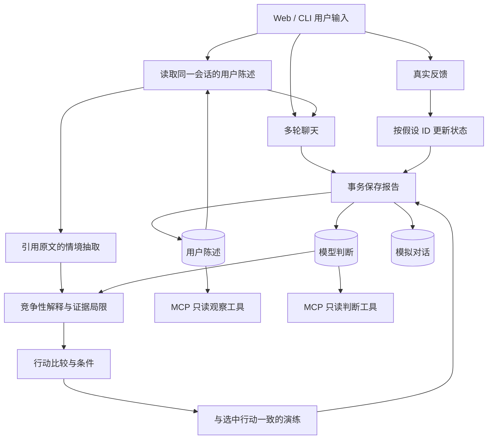

# Architecture / 架构与设计取舍

## 产品目标

给关系沟通中的不确定性提供可追溯的思考过程。系统不能观察对方内心；它帮助区分陈述、猜测和行动选择，并根据新陈述修正推测。

## 明确的边界

| 数据 | 存储层 | 能否作为现实观察检索 |
| --- | --- | --- |
| 用户原始输入、用户报告的反馈 | observation | 可以，标注 user_report_unverified |
| 抽取候选、解释、行动、修正 | inference | 单独作为未经独立核实的判断提供 |
| 假设的对方回答、练习话术 | simulation | 不可以 |

引用校验保证文字出现在输入中，不能保证被引用的句子在现实中为真，也不能完全判断它是否属于猜测。语义层仍依赖模型和人工评测。用户说“我怀疑他有别人”不能因为文字出现了就被认为出轨已发生；案例评测专门检查这一点。

## 执行与恢复

每次操作有 session_id 和 run_id。运行前冻结不含 Key 的模型配置与有界上下文，每个通过验证的阶段保存检查点。异常时记录已完成阶段和精简错误。恢复必须保持协议、地址、模型一致，允许更换 Key。

完整报告与三层记忆在一个 SQLite 事务中提交。唯一约束防止同一运行重复追加；完成的 run 再次执行直接返回既有报告。网页单工作线程串行调度，避免同时反馈覆盖判断。当前按单用户、单服务进程使用；没有跨进程运行租约或分布式队列。

执行记录含阶段名、耗时、可用的 token 用量及检索记录 ID；它不记录模型隐藏思维链。错误不回显服务商原始响应或 Key。

## 上下文工程

最多检索同一会话最近 8 条观察，序列化字符预算 6000；不做向量搜索。原输入最多 6000 字符，每阶段 API 输入最多 24000 字符，输出最多 16000 字符。超过预算明确失败，不静默丢弃当前问题。字符限制是便于复现的近似约束，不是服务商 tokenizer 的精确计费。

聊天使用同一会话最近最多 12 组已完成的问答，保留 user/assistant 角色，同时读取最多 3000 字符的用户陈述。历史助手回复用于承接对话，不作为现实观察。聊天输入与回复也进入不同记忆层。

反馈只更新已存在的假设编号，引用当前反馈原文，保留旧运行结果和新版本。已经由反馈支持或削弱的判断不能在下次分析中被无声重置，需通过反馈流程改写。

## 模型适配与工具

providers.py 为 Anthropic Messages / Chat Completions 处理不同消息结构、认证、响应包装。聊天的 `max_tokens` 为 768，分析阶段为 4096；GLM-5.3 请求使用 `reasoning_effort=low`。本地服务默认最多发起 20 次真实 API 请求尝试。每个 HTTP 请求最多两次尝试（只重试部分限流/5xx），结构修复最多再生成一次；不能保证超时的远端请求没有计费。

skills.py 暴露固定阶段的指令与合约。engine.py 决定调用顺序、检索和提交；模型不自行获取 shell 或文件权限。MCP 是可选的独立 stdio 接口，用官方 SDK 向 Host 暴露指定会话的观察和判断。业务执行不依赖 MCP 连接。

## 当前范围

已实现本地双语网页、CLI、多协议模型接入、运行时换 Key、持久会话、证据边界、反馈修正、失败恢复、轨迹、离线与在线评测入口、只读 MCP。

公开部署、身份登录、数据库加密、多用户授权、向量检索、自主规划与工具选择、Multi-Agent、模型训练以及玄学扩展均未实现。第一版的工程重点是证明数据边界和恢复行为能被测试，而不是堆叠概念。
