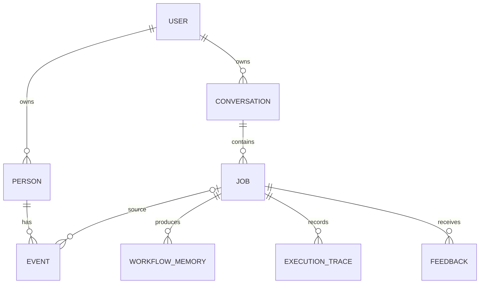

# Persona AI 产品与架构

## 产品目标

帮助成年用户在一个聊天入口中持续讨论不同关系对象，减少反复交代背景；让他们能知道、修正、删除系统记住的内容。主线是聊天与人物记忆，研究搜索只在需要证据时出现。

人物不是独立Agent。一个主Agent通过固定工作流使用人物上下文与工具。普通用户界面不出现Harness、JSON、Base URL等工程设置。

## 数据关系

每个资源均带user_id；人物通过person_id关联。API接到客户端ID后，必须在服务端使用user_id再次查询。UUID不是权限控制。生产数据库没有实现RLS，隔离依靠ScopedStore与接口鉴权，并用越权测试覆盖；未来若添加RLS，不能替代这些检查。

当前初始schema为v1，使用schema_versions记录和幂等建表；拒绝打开更高版本的数据库。尚无跨历史版本的ALTER迁移，未来新增列必须写显式迁移。旧版memory/v2单用户数据不会自动导入。

## 请求流程

1. 验证登录Cookie、Origin和CSRF，校验输入长度。
2. 通过昵称、别名和可见人物选择解析指代。多人或代词无法明确时返回澄清；不自动创建陌生人物。
3. 优先执行有限的高风险/骚扰预检。规则未覆盖的情况仍由所有相关阶段的系统提示处理。
4. 在用户、人物范围内检索已确认事件；结合词项匹配和时间排序。只有对应人物和同一记忆版本的有限历史进入上下文。
5. 冻结上下文与模型配置，事务中再次核对记忆版本，拒绝准备期间发生修改的旧上下文，然后创建持久任务，返回run_id。客户端轮询状态。
6. 工作线程原子领取任务，逐阶段执行路由、聊天/知识/分析/反馈。学术检索在模型去标识化后，再移除已登记人物名与明显联系方式。
7. 每次实际模型HTTP请求先在数据库预留次数与估算预算；重试、JSON修复都经过同一计量钩子。
8. 每阶段保存检查点；成功时在事务内保存报告与分层记忆。明确的单人物陈述可生成待确认卡片，不能自动当作事实。

## 记忆边界

| 层 | 内容 | 后续使用 |
|---|---|---|
| 人物资料 | 用户填写的背景、别名、印象、可选星座 | 标记来源；印象与星座不是行为证据 |
| 事件 | 用户确认的原始陈述或手动记录 | 可按人物跨会话检索；不是独立核实事实 |
| 感受/印象 | 用户选择的分类 | 带类型提供，不能升级成客观事实 |
| 模型推测 | 分析、建议、修正 | 不作为人物经历 |
| 演练 | 假设的对话分支 | 不进入真实事件检索 |

待确认候选保存完整用户陈述，不是语义层面自动抽取的事实。问题、演练、知识请求和不明确的多人输入不会自动建议记录；这些规则偏保守，仍须人工确认。

确认/编辑记忆会增加账号的context epoch。此前聊天仍可回看，但不再送入模型，失败任务的旧快照不可继续。这是有意选择的保守策略，代价是近期对话连续性降低。后续可改为细粒度依赖失效，但必须先保持相同删除/纠错标准。

删除人物或事件会删除涉及该人物的相关会话及生成结果；其他人物的独立事件保留。删除会话会同时删除来自该会话的记忆。UI在删除前说明影响。账号注销级联删除其人物、会话、运行和反馈；总体预算可保留去关联统计。

## 并发与恢复

数据库短事务有一个全局写锁：SQLite使用BEGIN IMMEDIATE，PostgreSQL使用行锁。锁内不调用模型或网络。其目标是首批10–20用户的简单可靠性，不是高吞吐架构。

默认两个执行线程；同一会话仅一个活跃任务，一个用户最多三个待处理任务。任务租约为300秒，每个模型请求和检查点续租。租约过期后显式失败，用户可恢复，避免服务重启后自动重复计费。worker token阻止过期执行者覆盖新结果。

浏览器重发使用幂等键，相同输入返回原任务；不同输入复用幂等键会拒绝。响应阶段完成后恢复不重复调用；但服务商收到请求后、本地检查点落盘前发生故障仍可能重复计费，系统不承诺外部API恰好执行一次。

## 费用与性能

Model attempts、供应商返回的tokens、配置价格估算、阶段耗时、完整任务耗时分别记录。全局每日预算按每次请求的保守预约额扣减，不因失败退款，因此可能提前用尽。生产要求预约额覆盖配置价格下的保守输入/输出估算。该机制不代表服务商账单上限；学术搜索独立计费。

首版不在重试时悄悄更换模型，也不在API失败时伪装为Mock成功。先用同一套案例比较模型质量、P50/P95延迟和成功任务成本，再选默认模型。

## 安全和未实现项

应用级租户隔离、Cookie安全属性、CSRF/Origin校验、登录限流、输入预算已实现。服务器日志不记录对话、模型原始报错或Key。原始数据在数据库内仍是明文；生产存储加密、TLS、最小权限、地域与备份由托管层实际配置验收。

当前未实现向量检索、多个自主Agent、精确token预估、流式输出、邮件找回密码、RLS、开放互联网的OAuth MCP服务、计费订阅。邀请制用户忘记密码需由运营者验证身份后在终端重置。
